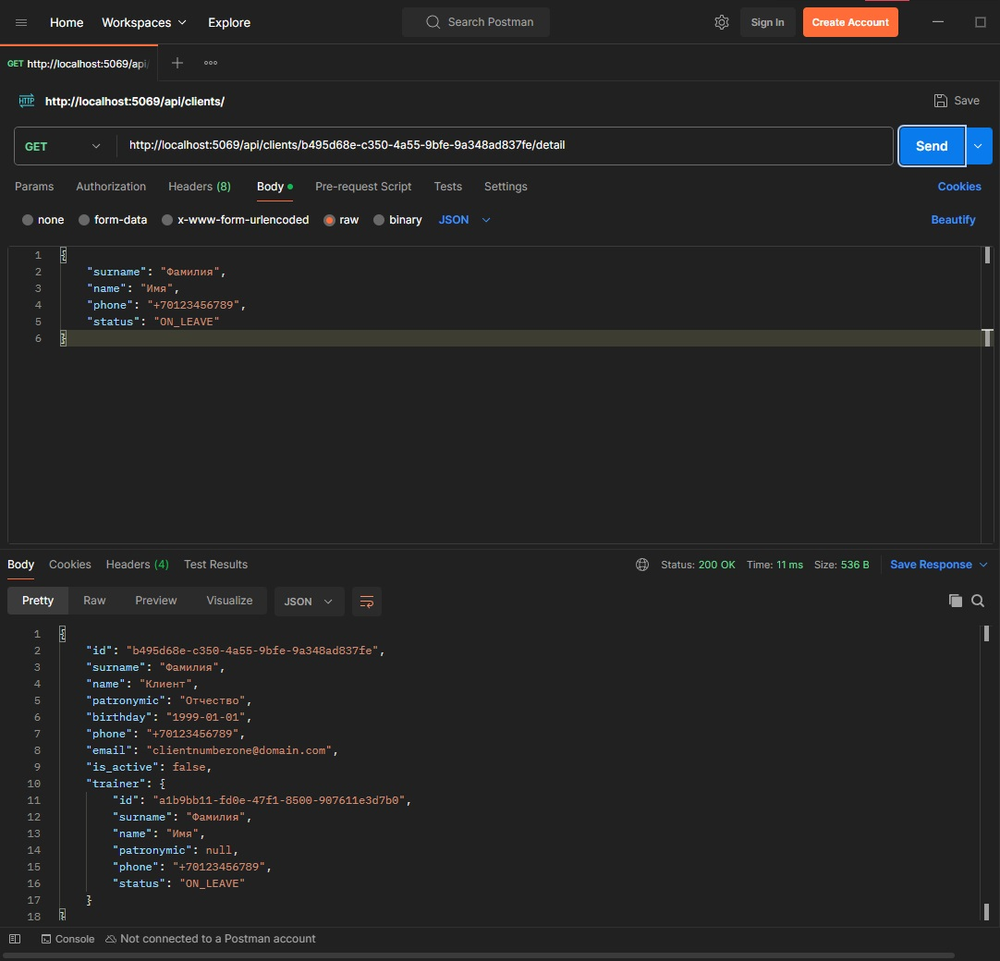
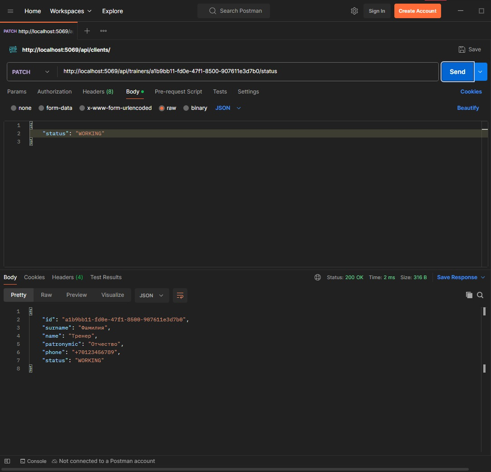

# fitnesscentrerestapi
## Выбор технологий
| Технология | Выбор |
| - | - |
| Язык программирования | С# |
| Фреймворк | ASP.NET Core |
## Шаги по реализации
1. Создал модель данных клиентов (Client)
2. Создал модель данных тренеров (Trainer)
3. Написал логику эндпоинтов клиента (/api/clients)
4. Написал логику эндпоинтов тренера (/api/trainers)
## Демонстрация результата
*Рис. 1.: POST: /api/clients*

*Рис. 2.: PUT: /api/clients/{id}*

*Рис. 3.: GET: /api/clients*

*Рис. 4.: GET: /api/clients/{id}*

*Рис. 5.: GET: /api/clients/{id}/detail*

*Рис. 6.: PATCH: /api/clients/{id}/status*

*Рис. 7.: POST: /api/clients/{clientId}/trainer/{trainerId}*

*Рис. 8.: POST: /api/trainers*

*Рис. 9.: PUT: /api/trainers/{id}*

*Рис. 10.: PATCH: /api/trainers/{id}/status*

*Рис. 11.: GET: /api/trainers/{id}/detail*

*Рис. 12.: GET: /api/trainers*

